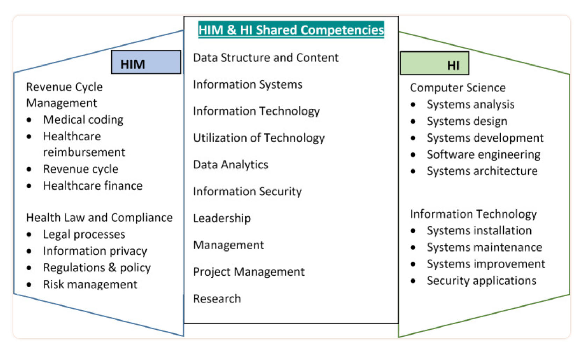
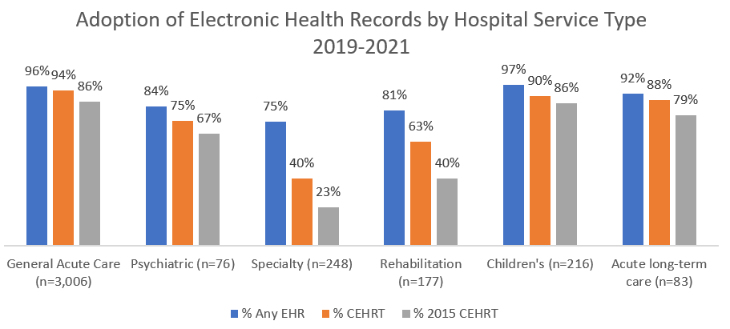
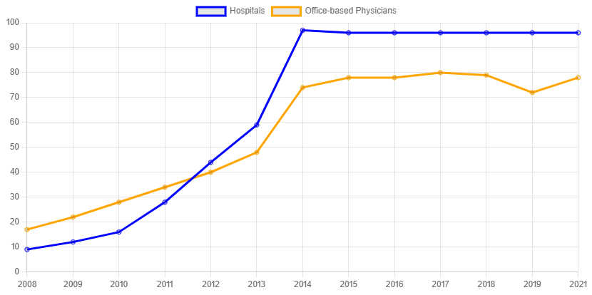
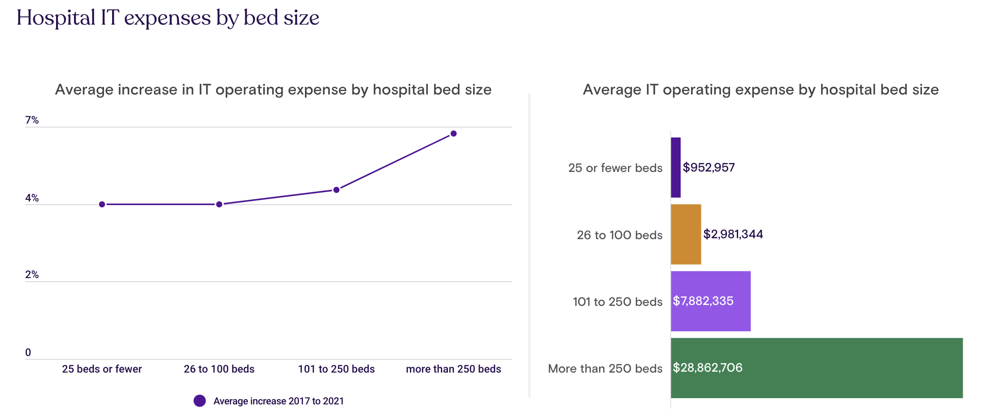

# Intro Day
### HAN-462: Health Information Systems

---

## Who I am

- **Hants Williams**: Nurse, Data Engineer, etc...

---
## Examples of what I do (building): 
- **Recent projects**
  - SDoH resources v1 - external community ([Inclusion](https://inclusion.appliedhealthinformatics.com/))
  - SDoH resources v2 - internal SBM ([SDoH](https://sdoh.ahi-projects.com/))
  - Data discovery tool - external ([Discover](https://discover.appliedhealthinformatics.com/))

---
## Your up-coming graduation:

How many people have jobs linedup? 

---
- **Graduation Timeline**
  - T-minus 4 months till graduation; job search can take 3-6 months on average.
  - [Average job search duration](https://www.washington.edu/doit/what-can-students-do-improve-their-chances-finding-employment-after-college#:~:text=The%20fact%20is%20that%20approximately,to%20secure%20employment%20after%20graduation)
- **Master's Program**
  - AHI, 15-month program - accepting applications for Summer 2024
  - [https://healthprofessions.stonybrookmedicine.edu/programs/ahi](https://healthprofessions.stonybrookmedicine.edu/programs/ahi)

---

## Basic Definitions

- American Medication Informatics Association (AMIA)
- **AMIA Definitions**
  - Health Informatics: the science of using data, information, and knowledge to improve human health and healthcare services.
  - HIM: acquiring, analyzing, and protecting medical information; a mix of business, science, and IT.
- [NCBI Article](https://www.ncbi.nlm.nih.gov/pmc/articles/PMC8649705/)

---

---

## Operating Landscape

- **Healthcare Systems**
  - Hospitals
  - Insurance (payers)
  - Consulting
  - Pharma(biotech)
  - Tech/Vendors

---

## HIS Components
- **Medical Records**
  - EMR / EHR 
    - Big players: Epic and Cerner 
    - EMR: 1 group/hospital vs EHR: multiple/shared between groups/hospitals
  - HITECH: Adoption 
  - Average cost of a Epic/Cerner go-live - implementation? 
  - First EMR system?

---

## First EMR? 
- The VA believe it or not 
- [https://www.oit.va.gov/about/history.cfm?](https://www.oit.va.gov/about/history.cfm?)
- 1970s - led to open sourcing / VistA 

---

## EMR go-live preview: 
- With Epic or Cerner could be > millions to billions of dollars
- Duration >= 3-4 years 
- Fun examples: 
    - Duke Health System and UMASS with Epic: 700m 
    - Partners Health System: 1.2b 
    - Mayo Clinic with Epic: 1.5b 
    - VA with Cerner: 4-10b 

--- 
## Links:
- [https://www.beckershospitalreview.com/healthcare-information-technology/8-epic-ehr-implementations-with-the-biggest-price-tags-in-2015.html#:~:text=For%20example%2C%20Duke%20University%20Health,according%20to%20a%20Forbes%20report.](https://www.beckershospitalreview.com/healthcare-information-technology/8-epic-ehr-implementations-with-the-biggest-price-tags-in-2015.html#:~:text=For%20example%2C%20Duke%20University%20Health,according%20to%20a%20Forbes%20report.)
- [https://www.healthcareitnews.com/news/how-cerner-won-biggest-ehr-deal-ever-twice](https://www.healthcareitnews.com/news/how-cerner-won-biggest-ehr-deal-ever-twice)
- [https://www.beckershospitalreview.com/ehrs/10-ehr-implementations-with-the-biggest-price-tags-in-2017?utm_campaign=bhr&utm_source=website&utm_content=related](https://www.beckershospitalreview.com/ehrs/10-ehr-implementations-with-the-biggest-price-tags-in-2017?utm_campaign=bhr&utm_source=website&utm_content=related)

---

[https://www.healthit.gov/sites/default/files/2022-03/chart.PNG](https://www.healthit.gov/sites/default/files/2022-03/chart.PNG)

---

[https://www.healthit.gov/sites/default/files/2022-10/ehr-adoption-for-congressional-report-and-blogpost.png](https://www.healthit.gov/sites/default/files/2022-10/ehr-adoption-for-congressional-report-and-blogpost.png)

---
## HIS Components Continued...
- **Patient Portals**
  - PHR:
    - MyChart (EPIC)
    - MyHealth (CERNER)
  - Usually come with EMR/EHR otherwise will be add-on, custom...
    - Stanford MyHealth (not cerner but has same name)
    - [https://myhealth.stanfordhealthcare.org/#/](https://myhealth.stanfordhealthcare.org/#/)
    - Case study of BUILD vs BUY (future SDLC topics)" 
        - [https://365.himss.org/sites/himss365/files/365/handouts/552564121/handout-29.pdf](https://365.himss.org/sites/himss365/files/365/handouts/552564121/handout-29.pdf)

---
## HIS Components Continued...
- **Monitoring and Engagement**
  - Remote Patient Monitoring: RPM
    -   
  - Customer Relationahip Managers: CRMs
    - non-traditional; SalesForce 

---

## HIS Components Continued...
- **Management**
  - ERPs, PMS - SalesForce, Hubspot, Oracle, SAP

---
## HIS Components Continued...
- **Medications and Labs**
  - E-prescribing, PBMs, LIS - Surescripts, Sunquest

---
## HIS Components Continued...
- **Scheduling and Imaging**
  - Patient, Staff, Credentialing, RIS, PACS

---

## HIS Components Continued...
- **Billing and Revenue**
  - RCM, Claims/Insurance

---
## HIS Components Continued...
- **Supply Chain and Clinical Trials**
  - SAP, Oracle, IQVIA, Parexel

---
## HIS Components Continued...
- **Analytics**
  - Tableau, PowerBI

---
## HIS Components Continued...
- Any many more....

Review article: 
[Best RCM Tools](https://www.beckershospitalreview.com/finance/the-31-best-rcm-tools-per-klas.html)

---

## Financial Burden of HIS on systems 

- Average hospital IT operating expense: 8.4 million
- Average hospital IT operating expense as a percentage of total operating expense: 3-4%
- Hospitals with 25 beds or fewer spend less than $1 million for IT solutions, compared to hospitals with more than 250 beds, which spend nearly $29 million on average.
- Hospitals with more than 250 beds also had the highest average annual increase in IT expenses since 2017 at more than 6%. Hospitals with 250 or fewer beds had average IT expense increases of less than 5%.

[https://www.definitivehc.com/resources/healthcare-insights/average-it-expenses-us-hospitals](https://www.definitivehc.com/resources/healthcare-insights/average-it-expenses-us-hospitals)

---

[https://www.definitivehc.com/resources/healthcare-insights/average-it-expenses-us-hospitals](https://www.definitivehc.com/resources/healthcare-insights/average-it-expenses-us-hospitals)

---

## Current Challenges in HIS

- **Design and Development**
  1. Risk assessment tools
  2. UI design standards
  3. Software safety in networks
  4. Unambiguous patient ID

---

## Current Challenges in HIS Continued...
- **Implementation and Use**
  5. Decision support for safety
  6. IT transition management

---

## Current Challenges in HIS Continued...
- **Monitoring and Optimization**
  7. Automated system monitoring
  8. Cultural and legal frameworks
  9. Patient-centric Health IT safety

---

## Key Terms and Roles

- **Technology Stack**
  - [StackShare](https://stackshare.io/stacks)

---
- **System Selection Factors**
  - Delivery modalities: asynchronous, synchronous; in-person, remote.

---
- **Roles in Health Information Systems**
  - CIO, CTO, CMIO, CNIO, CISO, CDO, etc.
- **Career Paths**
  - [Job Titles in Informatics](https://blog.appliedhealthinformatics.com/posts/job-titles-informaticists)
